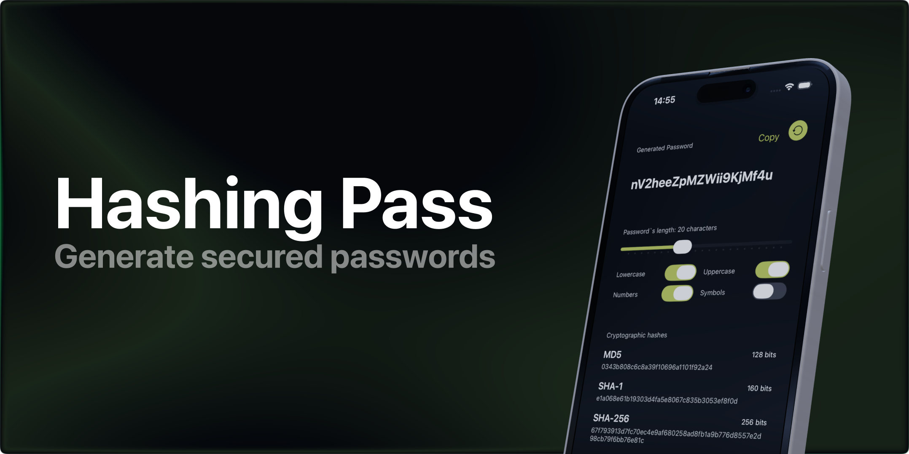

  <i>A practical, open-source iOS app that generates secure passwords using hardware entropy (<code>SecRandomCopyBytes</code>).</i>

  
  
  
  
  

## About

HashingPass is designed for speed and ultimate security. Instead of relying on standard pseudo-random number generators, it utilizes the device's cryptographically secure hardware noise via Apple's `SecRandomCopyBytes` API to ensure mathematically unpredictable passwords.

## Features

* **Cryptographically Secure:** Powered natively by `CryptoKit` by Apple
* **Fast & Practical:** Generate and copy complex passwords instantly to your clipboard.
* **Privacy First:** Zero tracking, zero data collection, and completely offline.

## License and Publication

The application is under the [MIT License](LICENSE) and published on the App Store.
